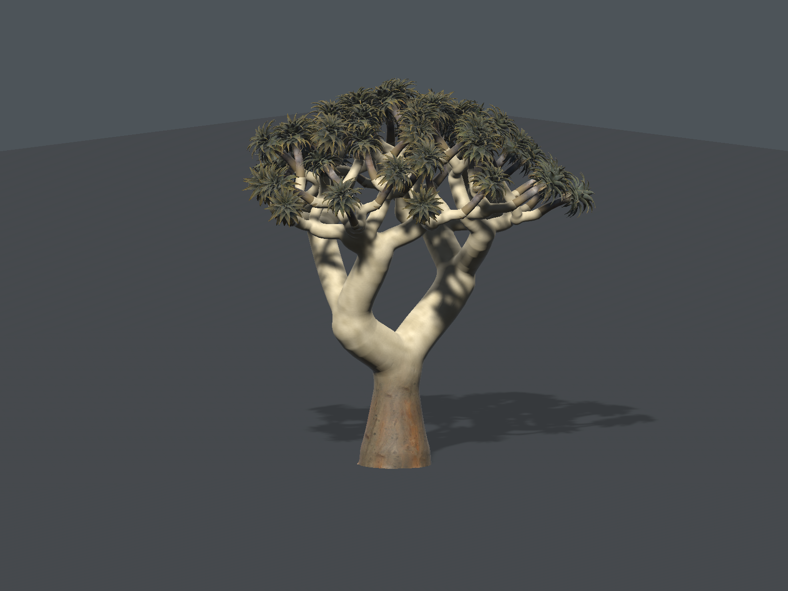

# ✦ Kooker: Starfall

**Where the sky becomes a world.**

A world in the making · Unity 6 · Windows preview

[Explore the direction](docs/STARFALL.md) · [Visual progress](docs/KOKERBOOM-VISUAL-REVIEW.html) · [Build & run](#-build--run) · [Credits](docs/ASSET-CREDITS.md)

*Actual Unity URP output, 10 September 2026 · R16 tree study · WIP. This offscreen image shows a later tree revision than the currently built R06 player. It is not concept art or a finished world.*

Beneath a blue giant and a river of stars, warm desert gives way to luminous seas. Explore, shape, and one day inhabit a world still becoming.

**That is the destination. Today, Starfall is an approximately 60 m tree and blue-giant study** with a separate local Windows preview. The sculpted landscape, visible galaxy and living sea are planned. World shaping, houses, building tools, inhabitants, bots and shared-world connections are future work.

## 🌌 The world ahead

| Element | Direction | Current state |
|---|---|---|
| Trees | Gold and ochre kokerboom trunks, rounded crowns and cool blue-green rosettes | Deterministic 3D family under review |
| Land | Warm sculpted mesas, rocky shores and turquoise bays | Small ground study only |
| Sky | A large blue gas giant, moons and a distant galaxy | Prototype giant and stars; wider sky work planned |
| Sea | Clear shallows, submerged arches, kelp-like growth, coral forms, fish schools and rays | [Living sea design](docs/STARFALL-LIVING-SEA.md); unimplemented |
| Life and building | Explore, shape and eventually inhabit the world | Future scope |

The [visual direction](docs/KOKERBOOM-REFERENCE.md) records the concept references separately from actual Unity evidence. The new landscape will have its own versioned world definition, preserving the earlier island and its saved edits.

## 🌳 Watch the trees take shape

*Actual Unity R16 neutral inspection · WIP. Open the local [visual review catalogue](docs/KOKERBOOM-VISUAL-REVIEW.html) in a browser to compare preserved rounds and camera views. GitHub displays the HTML source; the [Markdown milestone index](docs/VISUAL-MILESTONES.md) is readable there directly.*

The latest full-family review is **R16: 5.75/10, not accepted**. Botanical fidelity is **6.75/10** and art identity **5.75/10**. Both must reach **9/10 with no major defect** before the tree family anchors the larger landscape. The critic retains the fuller PH02 rosettes; support-to-branch seams, bend shading, ground contact, bark peeling and blue-green foliage under ordinary game light remain active work. All 21 images were independently reviewed. The main R16 tree has **6,591,379 triangles** and took **517,901 ms** to create cold in the editor ([authoring record](evidence/verified/kokerboom-round-16-authoring-cost.json)); this is authoring cost, not FPS. See the [exact critique](docs/KOKERBOOM-CRITIQUE.md#round-16-ph02-fitted-crown-family-rejected).

## 🎮 Build & run

Use **Unity 6000.6.0f1** with Windows build support. URP **17.6.0** and Input System **1.20.0** are pinned in [Packages/manifest.json](Packages/manifest.json).

From the repository root, build the separate preview with a fresh evidence round:

~~~powershell
.\tools\render-kokerboom.ps1 -Round round-100 -PlayablePreview
~~~

Choose an unused round number; the label only identifies evidence and does not affect world generation. The script renders two study views and bakes a Windows player into `Builds/KookerStarfall-<UTC>/`. It preserves earlier captures, refuses to run alongside another Unity editor and does not launch the player. Open `KookerStarfall.exe` from the resulting folder; keep the data folder and DLLs beside it.

**The Starfall branding is source-only until this new build is verified.** The retained [R06 build record](evidence/milestones/kokerboom/round-06/preview-build.json) refers to the earlier `CosmicWorldPreview.exe`, which has already been used as a local WIP preview. The latest R16 images are not screenshots of that executable. The [checked R06 package](evidence/verified/starfall-r06-package-check.json), `Kooker-Starfall-WIP-R06-Windows.zip` (161.42 MiB), preserves all 183 runtime files unchanged; packaging did not rebuild the player.

| Control | Action |
|---|---|
| WASD | Move |
| Hold right mouse button | Look |
| Shift | Move faster |
| F | Switch walk / inspection flight |
| Q / E | Lower / raise flight height |
| Escape | Release the pointer |
| Alt + Enter | Toggle window / fullscreen |

Walking follows the ground at 1.85 m eye clearance and stays within the study. This is an inspection controller; rocks do not yet have complete collision. F12 capture requires an explicit absolute folder passed with `-previewEvidence`; the preview does not capture automatically.

The preview has no implemented multiplayer, bot connections or saved-world loading. Offline operation and engine telemetry have not been fully validated. Legacy island build commands and controls remain in the [earlier island guide](docs/LEGACY-ISLAND.md).

## Evidence at a glance

| Claim | Status | Evidence | Remaining gap |
|---|---|---|---|
| Separate Windows study | R06 build succeeded; local WIP used | [Build record](evidence/milestones/kokerboom/round-06/preview-build.json) | Full native controls, collision and measured performance acceptance |
| Latest full tree family | R16 rejected, overall 5.75/10 | [21-view manifest](evidence/milestones/kokerboom/round-16/metrics.json), [independent critique](docs/KOKERBOOM-CRITIQUE.md#round-16-ph02-fitted-crown-family-rejected) | Both visual means ≥9; no major defect |
| Changed PH02 family | **Numeric FAIL at assertion 522:** full-age root extends below the unchanged −1 m floor | [Exact failure report](evidence/verified/kokerboom-round-16-ph02-validation-failed.json) | Repair buried root geometry and rerun; visual score remains 5.75, rejected |
| Starfall branding | Repository renamed; source updated | [Naming and continuity record](docs/STARFALL.md) | Branded build and runtime verification |
| Wider world and living sea | Planned | [World direction](docs/STARFALL.md), [sea plan](docs/STARFALL-LIVING-SEA.md) | Implementation and actual scene evidence |

## 🧭 Project guide

| Start here | Reference |
|---|---|
| World direction and naming | [Starfall](docs/STARFALL.md) · [Living sea](docs/STARFALL-LIVING-SEA.md) |
| Images and review | [Visual catalogue](docs/KOKERBOOM-VISUAL-REVIEW.html) · [Milestones](docs/VISUAL-MILESTONES.md) · [Tree critique](docs/KOKERBOOM-CRITIQUE.md) |
| Assets and provenance | [Asset catalogue](docs/ASSET-CATALOGUE.md) · [Credits](docs/ASSET-CREDITS.md) · [Portable notices](Assets/CityLife/Art/THIRD-PARTY-NOTICES.txt) |
| Determinism and saved edits | [World foundation](docs/WORLD-FOUNDATION.md) · [Legacy island](docs/LEGACY-ISLAND.md) |
| Verification and contribution | [Evidence record](docs/VERIFICATION.md) · [CI and safeguards](docs/CI.md) |

The repository is [duikindiesee/kooker-starfall](https://github.com/duikindiesee/kooker-starfall). Its history and draft review continue under the new name. Internal `CityLife.World` namespaces, `Assets/CityLife` paths, legacy product settings, world IDs and save contracts remain intact; branding does not migrate an existing world.

Contribute through branches and pull requests. Retain provenance, licences and earlier evidence. Keep credentials, private runtime profiles, player state, downloaded archives and raw machine logs out of the public repository.
