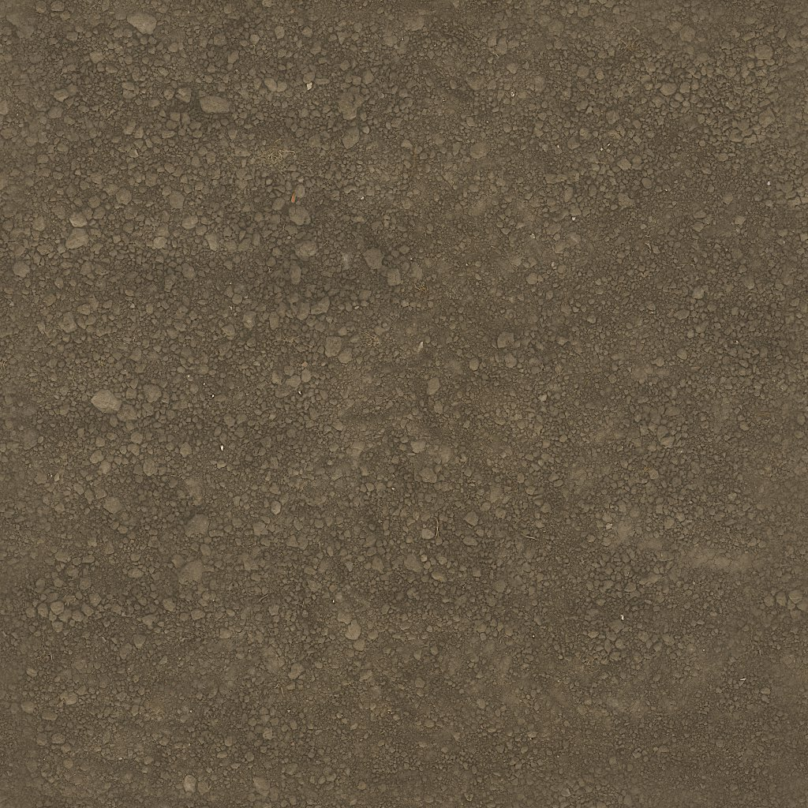
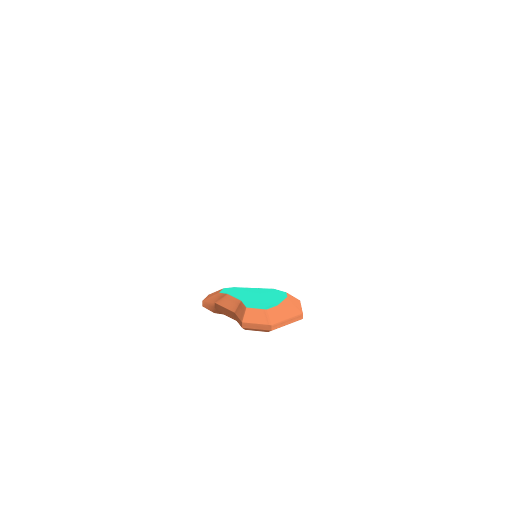
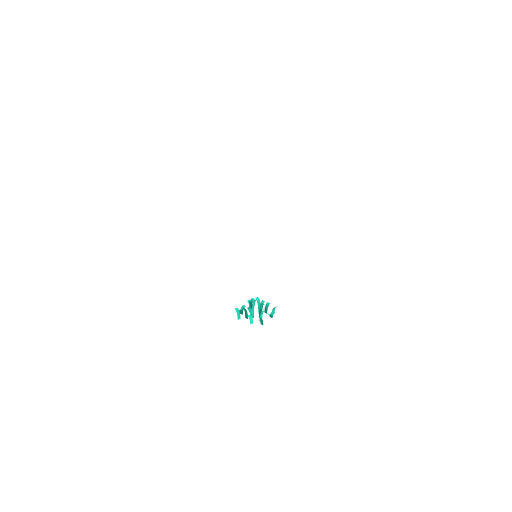

# CityLife arid asset catalogue

Verified 9 September 2026. Three bounded choices: one ground texture selected for this milestone, plus two model candidates. The images below are actual licensed asset files or unmodified previews shipped inside a CC0 download. They are not concept images or proof of Unity scene integration. No paid asset is included.

[Open the portable visual catalogue](ASSET-CATALOGUE.html) for a 7× grass preview and 3× rock preview. These are CSS enlargements of the unchanged source PNGs; both models remain unimported.

| Item | Available free | Downloaded | Integrated into the island | Tested |
| --- | --- | --- | --- | --- |
| Poly Haven Dry Mud Field 001, 1K diffuse | Yes, CC0 | Yes; unchanged 339,575-byte image in `Assets` | Yes; terrain material | Texture visible in the candidate offscreen walking image; route passed with no observed runtime errors |
| Kenney Nature Kit `rock_largeA` | Yes, CC0 | Archive inspected; licensed preview retained; model not imported | No; candidate | Preview decoded; model/URP/collision untested |
| Kenney Nature Kit `grass_large` | Yes, CC0 | Archive inspected; licensed preview retained; model not imported | No; candidate | Preview decoded; model/URP/placement untested |

## 1. Dry Mud Field 001 — selected ground detail

[Official asset](https://polyhaven.com/a/dry_mud_field_001) · [Exact 1K diffuse download](https://dl.polyhaven.org/file/ph-assets/Textures/jpg/1k/dry_mud_field_001/dry_mud_field_001_diff_1k.jpg) · [Publisher licence](https://polyhaven.com/license)

Photograph-based dry compacted soil with small stones. The publisher gives a 3 m tile height. Rob Tuytel photographed it; Rico Cilliers processed it. The selected file is 1024 × 1024, allowing nearby ground detail without importing a full high-resolution PBR set.

**Unity/URP:** an ordinary RGB albedo map, used by the CityLife terrain shader with the biome palette controlling its appearance. The source image itself is unchanged. Unity's [URP material reference](https://docs.unity3d.com/6000.0/Documentation/Manual/urp/lit-shader.html) documents this texture role. Integration is visible in the [candidate offscreen walking image](../evidence/milestones/04c-arid-walking-2026-09-09.png); the [route report](../evidence/verified/arid-detail-route.json) passed with zero observed runtime errors. This verifies offscreen rendering, not native presentation or unrestricted desktop performance.

**Resource:** `Resources.Load<Texture2D>("CityLifeArt/DryGround_1K")` from `Assets/CityLife/Art/Resources/CityLifeArt/DryGround_1K.jpg`.

## 2. Kenney rock_largeA — optional stylized rock

[Official Nature Kit](https://kenney.nl/assets/nature-kit) · [Exact free package](https://kenney.nl/media/pages/assets/nature-kit/37ac38a37b-1677698939/kenney_nature-kit.zip) · [Retained package licence](../Assets/CityLife/Art/Licenses/Kenney-Nature-Kit-License.txt)

Small stylized rock geometry with a distinct top surface. The publisher's original preview colours are shown; these are not an approved arid material treatment. The archive contains `Models/FBX format/rock_largeA.fbx` (25,590 bytes), OBJ/MTL and GLB alternatives. Only the archive's `Isometric/rock_largeA_SE.png` is retained for this catalogue.

**Unity/URP:** choose the FBX variant, then assign a CityLife/URP-compatible material and verify scale, silhouette and collision. [Unity lists FBX and OBJ as supported model formats](https://docs.unity3d.com/6000.0/Documentation/Manual/3D-formats.html); that does not certify this model's materials or prefab behaviour. No model was placed or tested in the world.

## 3. Kenney grass_large — optional grass clump

[Official Nature Kit](https://kenney.nl/assets/nature-kit) · [Exact free package](https://kenney.nl/media/pages/assets/nature-kit/37ac38a37b-1677698939/kenney_nature-kit.zip) · [Retained package licence](../Assets/CityLife/Art/Licenses/Kenney-Nature-Kit-License.txt)

A compact polygonal foliage clump. Its original bright foliage palette would need a deliberate straw/ochre treatment before choosing it for dry CityLife ground. The archive contains `Models/FBX format/grass_large.fbx` (52,888 bytes), OBJ/MTL and GLB alternatives. Only `Isometric/grass_large_SE.png` is retained here. The publisher's package licence identifies Nature Kit 2.1.

**Unity/URP:** the FBX route avoids requiring a glTF importer. Material mapping, density, culling, wind and cost remain untested. The current renderer's procedural dry tufts are a separate implementation; this catalogue entry does not claim those tufts are Kenney assets.

## Licence and evidence boundaries

All three entries are **CC0 1.0 Universal**: commercial use and redistribution are permitted; attribution is optional. We retain voluntary credits and the [full CC0 text](../Assets/CityLife/Art/Licenses/CC0-1.0.txt). The publishers' branding and unrelated website renders are not included. See [credits](ASSET-CREDITS.md), the [portable package notice](../Assets/CityLife/Art/THIRD-PARTY-NOTICES.txt), and the [hash/provenance manifest](../Assets/CityLife/Art/Licenses/provenance.json).

| Claim | Status | Evidence | Remaining gap |
| --- | --- | --- | --- |
| The chosen ground texture is free and redistributable | Verified from primary sources | Official asset/licence links; retained CC0 text and hash | None for the copied image's stated licence |
| Model catalogue images are licensed assets | Verified from downloaded package | Exact ZIP entries plus original `License.txt`; per-file hashes | Models remain candidates |
| Ground texture is integrated and rendered | Verified offscreen | Candidate walking image and passing route report linked above | Native presentation remains unverified; aesthetic preference is for review |
| Native desktop controls/presentation work | Not claimed | No desktop actions performed for asset work | Requires separately authorized native testing |
