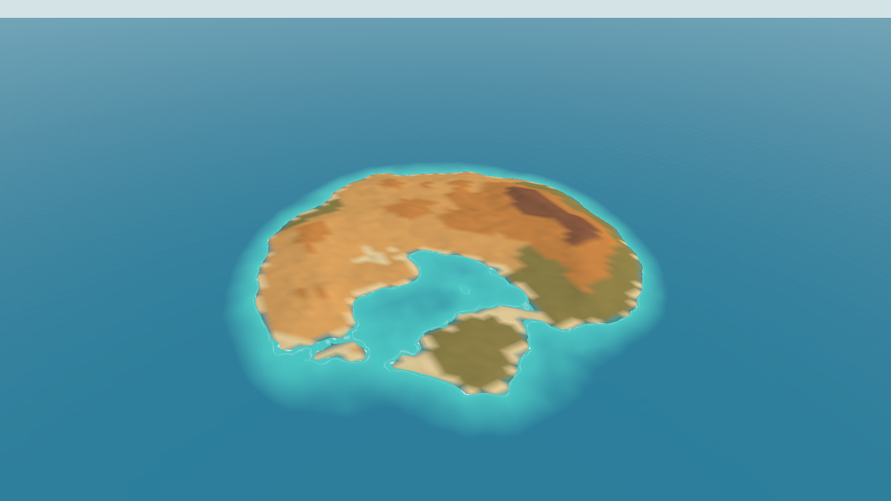
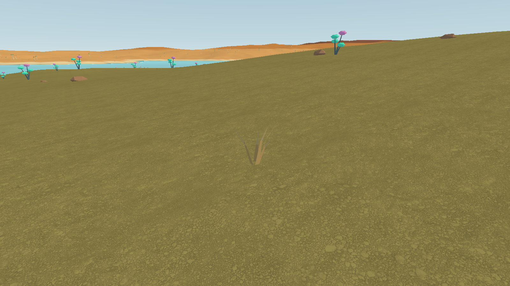

> Historical island README archived on 2026-09-10 during the Kooker: Starfall rename. These instructions describe the earlier CityLife island, not the standalone Starfall study. Historical offline wording below does not establish validated offline operation or absence of engine telemetry. Run its repository commands from the repository root. See [the current project introduction](../README.md) and [Starfall scope and rename record](STARFALL.md).

# CityLife Island — Unity

An island foundation preview for CityLife, built with Unity 6.6 / URP. The first milestone is a larger desert island to explore, carrying forward the browser game's sand, turquoise sea, quiver-tree forms and alien-sky direction. Roads, plots and the house-building tools will be designed deliberately in later milestones.





Actual Unity scene output at 1600×900. This offscreen capture excludes the interface. Earlier native-window images and the ground-level before/after sequence are retained in the [visual milestone catalogue](VISUAL-MILESTONES.md). Native keyboard/mouse acceptance remains outstanding; the [verification record](VERIFICATION.md) separates it from automated scene checks.

This repository starts a **new versioned island**. It does not overwrite the browser game or claim to import existing residents, roads, houses or world edits. The seed is 4242; the generation settings and algorithm version together identify the base world. The original CityLife random/noise/elevation maths is ported and compared with independent reference values from the pinned browser source. River carving and the old road layout are intentionally omitted.

## Open and build

For a packaged Windows preview, extract the entire ZIP and open `CityLife.exe`. Keep its data folder and DLLs together. See the included `README.txt` for controls and acceptance limits. No Unity installation or CityLife sign-in is required for the offline player.

Open this directory with **Unity 6000.6.0f1**. URP 17.6.0 and Input System 1.20.0 are pinned in `Packages/manifest.json`. Open `Assets/CityLife/Scenes/Island.unity`, then Play. For a first checkout before that scene has been prepared, choose **CityLife → Prepare island scene**.

From PowerShell with a licensed editor:

```powershell
& 'C:\Program Files\Unity\Hub\Editor\6000.6.0f1\Editor\Unity.exe' -batchmode -quit -projectPath $PWD -buildTarget StandaloneWindows64 -executeMethod CityLife.World.Editor.CityLifeBuild.BuildWindows -logFile "$PWD\evidence\local\build.log"
```

The build command runs source parity, deterministic regeneration and edit-persistence checks before building `Builds/Windows/CityLife.exe`. The Windows player is self-contained and does not need a Unity installation or CityLife login. `tools/build.ps1` runs the same command and retains a timestamped local log. The command-line build follows the [Unity player build documentation](https://docs.unity3d.com/6000.0/Documentation/Manual/build-command-line.html).

Use `tools/build.ps1 -BuildName Candidate` to build into a separate directory while another player is open. `tools/package.ps1 -BuildName Candidate` packages that build and writes its SHA256 checksum under `Builds/Download`. Neither command changes or launches the existing player window.

## Explore

WASD moves, right mouse looks, Shift moves faster. Q/E changes altitude while flying; the wheel adjusts speed or orbit distance. F switches walking/flying. O orbits. Home shows the island; 1 visits Landing, 2 the summit, 3 open land for future development. N switches day/night. H hides the interface. F12 saves a screenshot; F9 records a performance sample; Shift + F9 runs a repeatable route. See [the complete controls and measurement notes](exploration.md).

## Evidence and architecture

- [Visual milestone catalogue](VISUAL-MILESTONES.md) — real source/player captures, retained in sequence.
- [Source, identity and scope](SOURCE-AND-SCOPE.md) — exact reused concepts, intentional changes, source hashes and deferred integrations.
- [World format and rendering](WORLD-FOUNDATION.md) — physical scale, deterministic base, separate edits and distance LOD.
- [Verification record](VERIFICATION.md) — claims, evidence and remaining gaps.
- [Free-asset visual catalogue](ASSET-CATALOGUE.md) and [credits](ASSET-CREDITS.md) — previews, licences and actual integration status.
- [CI and public-repository safeguards](CI.md) — source workflow provenance, secret scanning and build constraints.

## Game and repository layout

The world has five convenient viewpoints: Island vista shows its extent; Landing coast starts ground-level exploration; Highlands shows the raised interior; Neighbourhood reserve identifies open land for later design; **4 / Detail** frames an existing dry grass tuft near Landing. The reserve is a view label, not a plot or ownership system.

| Directory | Purpose |
|---|---|
| `Assets/CityLife/Scenes` | Runnable island scene |
| `Assets/CityLife/Scripts` | Seeded field, edit overlay, renderer and walk/fly/orbit controls |
| `Assets/CityLife/Resources` | Versioned world definition and independent source test vectors |
| `Assets/CityLife/Shaders` / `Art` | URP scene materials, procedural visuals and credited imported art |
| `Assets/CityLife/Editor` | Scene preparation, meaningful world checks and Windows build entry point |
| `Assets/Settings` / `ProjectSettings` / `Packages` | Reproducible editor, rendering and package configuration |
| `tools` / `.github` | Build, isolated scene test, package and repository checks |
| `docs` / `evidence` | Architecture, licences, milestone images and reviewed verification reports |

`Builds`, `Library`, raw local logs, player state and downloaded archives are not source-control deliverables. Reviewed evidence uses repository-relative artifact references.

## Implemented and planned

| Area | Current scope |
|---|---|
| World | Versioned 4.096km region, approximately 6.007km² of sampled land, deterministic source-derived generation |
| Exploration | Walk/fly/orbit code, named views, day/night preview, screenshots and automatic tour; scripted travel tested, native control acceptance pending |
| Persistence | Base definition and separately fingerprinted terrain edits; atomic save/reload and rejection tests; no in-game edit tool yet |
| Appearance | Chunked terrain and sea, arid vegetation/detail iteration; actual evidence and asset status documented separately |
| Later milestones | Unity road/plot/house tools, imported HQ buildings, browser-save migration where explicitly designed, authoritative shared state and private household connections |

The initial region is 4096×4096 metres with a 4 m base grid and 256 m mesh chunks. Land occupies only part of that square; the UI reports measured land area. Distance-based mesh detail keeps the distant island affordable. It is not an infinite world or an implemented network streaming service.

Local world definitions and edits live in Unity's `Application.persistentDataPath/Worlds/<base-fingerprint>/`. The current executable is an offline exploration client; shared authoritative world state, household runtimes and the Kooker HQ integrations remain future work. No credentials or private runtime state are included.

World generation settings are not a player save. Changing their fingerprint creates a different world identity; saved deltas from another definition are rejected before application. Future roads, houses and ownership need their own explicit durable contracts. See [the world format](WORLD-FOUNDATION.md) before changing generation.

## Validation and contributions

`tools/build.ps1 -BuildName Candidate` runs the Unity world/persistence checks before producing the candidate player. `tools/smoke.ps1 -BuildName Candidate` launches a separate hidden process that renders an offscreen GPU route; it neither polls input nor changes cursor state or reads player saves. Its evidence excludes desktop presentation and native controls. A licensed Unity editor is needed to build, while repository CI runs the available independent checks described in [CI.md](CI.md).

Work lands through branches and pull requests. Main requires review. Retain source provenance and asset licence notices, scan history and files for secrets, inspect the actual package, and update the evidence record for material changes. Do not commit private archives, operator configuration, credentials or player data.
