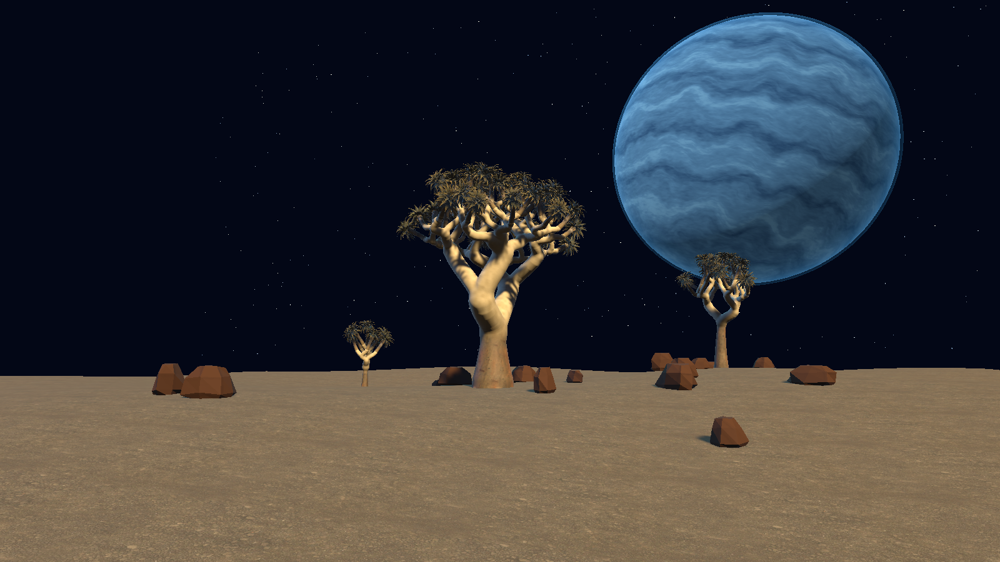

# Kooker: Starfall

*Where the sky becomes a world.*

Beneath a blue giant and a river of stars, warm desert gives way to luminous seas. Explore, shape, and one day inhabit a world still becoming.

[Project home](../README.md) · [Visual milestones](VISUAL-MILESTONES.md) · [Living sea plan](STARFALL-LIVING-SEA.md) · [Asset credits](ASSET-CREDITS.md)

*Actual Unity URP output, 10 September 2026 · R16 WIP. This later tree revision is an offscreen scene capture, not concept art or a screenshot of the older R06 executable. It has not passed the visual gate.*

## Current scope

The current standalone preview is an approximately 60 m baked tree and blue-giant study with a simple ground patch, rocks and walk/fly controls. Its tree family is still under review. The wider sculpted terrain, galaxy and living sea are in development; they are not completed features of this player. World shaping, houses, building tools, bots, inhabitants and shared-world connections remain future integrations.

The preview is intended as a local study and does not generate the earlier island. The preview has no implemented multiplayer, bot connections or saved-world loading. Offline operation and engine telemetry have not been fully validated. The earlier foundation and its instructions remain documented in [LEGACY-ISLAND.md](LEGACY-ISLAND.md).

## The world ahead — planned

Warm sculpted mesas and rocky shores will frame turquoise bays in a larger continuous landscape. The new region needs its own outline, seed and versioned world definition; it will not overwrite the earlier island or reinterpret its saved edits. The final extent has not been chosen, and an infinite world is not promised.

Above it, a large **blue gas giant** and a visible galaxy will establish the sky. Earth is excluded. The intended contrast is warm gold/ochre land and trees against cool foliage, water and navy space; the final visible-sun arrangement remains a separate design choice. The current prototype giant and stars do not establish a finished sky.

Below the surface, the [living sea plan](STARFALL-LIVING-SEA.md) calls for readable shallows, sculpted seabed shelves and arches, kelp-like growth, coral/anemone-like forms, varied fish schools and rays. Its walk-to-water, swim and return route is planned and unimplemented. This first sea slice proposes a bounded animated population, not an ecosystem simulation. Houses, building/shaping tools, inhabitants, bots and shared-world connections also remain future work.

The [reference record](KOKERBOOM-REFERENCE.md) identifies the user's concept attachments separately from actual Unity images. Those references guide composition and colour; they are not evidence of working features or licence grants for imported assets.

## Current evidence

| Claim | Status | Evidence | Remaining gap |
|---|---|---|---|
| Latest full tree family | **R16 rejected, 5.75/10 overall**; botanical 6.75, art 5.75 | [Independent critique](KOKERBOOM-CRITIQUE.md#round-16-ph02-fitted-crown-family-rejected), [21-view manifest](../evidence/milestones/kokerboom/round-16/metrics.json) | Both visual means must reach 9.0 with no major defect |
| Changed PH02 family | **Numeric FAIL at assertion 522:** full-age root extends below the unchanged −1 m floor | [Exact failure report](../evidence/verified/kokerboom-round-16-ph02-validation-failed.json) | Repair root geometry and rerun; ten closed wood samples do not turn the failed run into a pass |
| Separate Windows study | R06 build succeeded and local WIP was launched | [R06 build record](../evidence/milestones/kokerboom/round-06/preview-build.json) | Full native control, collision and performance acceptance |
| Wider world and living sea | Planned / unimplemented | [Living sea design and future acceptance route](STARFALL-LIVING-SEA.md) | Implementation after the tree gate and actual scene/input evidence |

The main R16 tree contains **6,591,379 triangles** and its cold editor creation took **517,901 ms** ([sanitized authoring record](../evidence/verified/kokerboom-round-16-authoring-cost.json)). This measures authoring cost, not FPS; stage attribution and sustained runtime suitability remain separate.

Open the [visual review catalogue](KOKERBOOM-VISUAL-REVIEW.html) locally in a browser to compare retained rounds. GitHub displays that HTML as source; use the [Markdown milestone index](VISUAL-MILESTONES.md) for navigation on GitHub. Render success and numerical passes do not change the independent visual decision.

## Rename record — 2026-09-10

The coordinating task verified the authorized GitHub rename below. These are the identifiers and review heads at that rename, not a claim about future branch movement. This branding change performs no further repository mutation.

| Claim | Status at rename | Evidence | Remaining gap |
|---|---|---|---|
| Repository renamed from `duikindiesee/citylife-unity` to `duikindiesee/kooker-starfall` | Verified by coordinating task | [Repository](https://github.com/duikindiesee/kooker-starfall); unchanged numeric repository ID `1360600603` | None for rename |
| Existing pull request retained | Open draft PR #1 | [Draft PR #1](https://github.com/duikindiesee/kooker-starfall/pull/1); head `0d4291b`, base `0e6544e` at rename | New source work is not implied to be pushed, merged or accepted |
| Local remote points to renamed repository | Read directly during branding work | `git remote -v`: fetch/push `https://github.com/duikindiesee/kooker-starfall.git` | Existing filesystem checkout paths stay unchanged |
| Preview branding updated | Source only; unbuilt | [HUD source](../Assets/CityLife/Scripts/CosmicPreviewExplorer.cs), [preview build source](../Assets/CityLife/Editor/CosmicPreviewBuild.cs) | Next coordinated build and runtime verification |

The repository retains its history and review. Internal `CityLife.World` namespaces, `Assets/CityLife` paths, generator/world identifiers, legacy scene/build entry points, player-save contracts and local checkout directories are unchanged. The display rename is not a world migration. The legacy project company/product values are preserved; the separate preview build temporarily sets its own product and restores project settings in `finally`.

## Source branding and existing evidence

- Display name and HUD: **Kooker: Starfall**; the HUD continues to say **WIP local preview** and explicitly identifies terrain, galaxy and living sea as in development.
- Next-build Windows product: `Kooker Starfall`; executable: `Builds/KookerStarfall-<UTC>/KookerStarfall.exe`. The filesystem-safe product name omits the display colon.
- Internal class names, generated scene paths, command-line options, input logs and screenshot filename prefixes remain unchanged.
- The already-built [R06 preview](../evidence/milestones/kokerboom/round-06/preview-build.json) retains its earlier `Cosmic World Preview` product and `CosmicWorldPreview.exe`. Branding work did not restart, rebuild or alter that running player. The [checked R06 ZIP](../evidence/verified/starfall-r06-package-check.json) packages its 183 runtime files unchanged with three documentation files; it does not contain a newly built R16 family.
- R06 and all earlier inspection captures retain their original filenames and labels. The latest full-family [R16 PH02 inspection](../evidence/milestones/kokerboom/round-16/metrics.json) remains visually rejected; its images show the source state at capture, not a newly branded runtime.

The previous README is retained in full below its historical notice in [LEGACY-ISLAND.md](LEGACY-ISLAND.md), with relative links adjusted for its new directory. Its island size, functionality and verification claims remain historical; they do not describe the small Starfall study.
