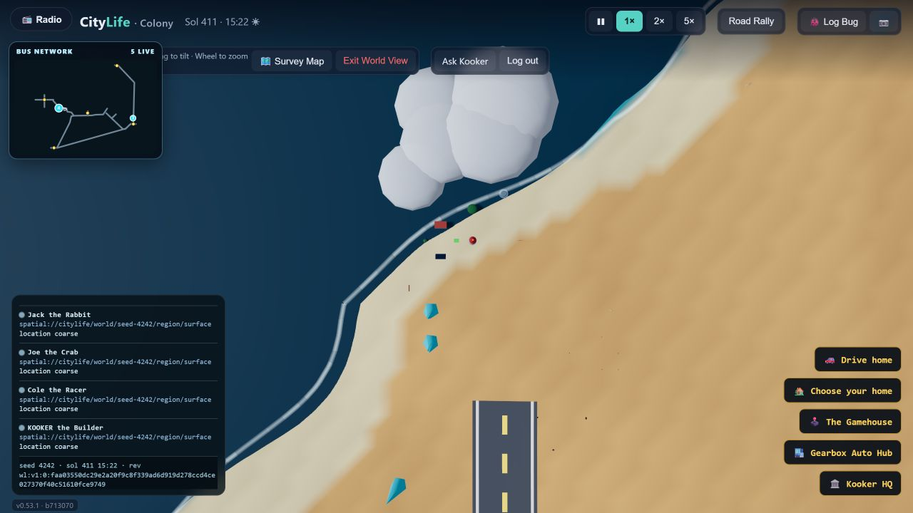
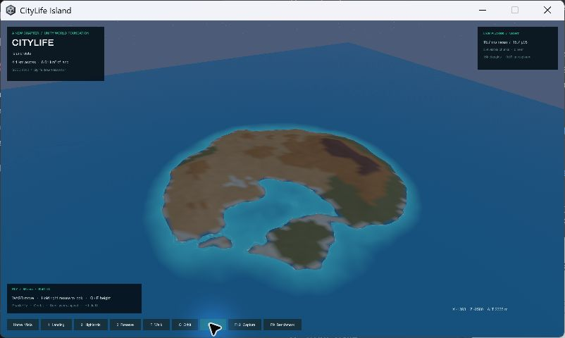
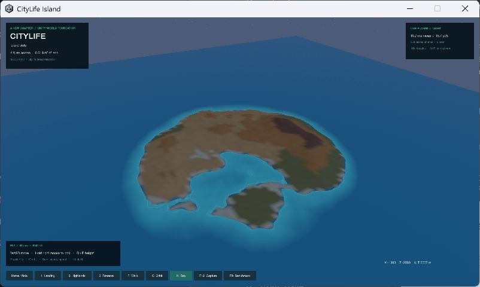
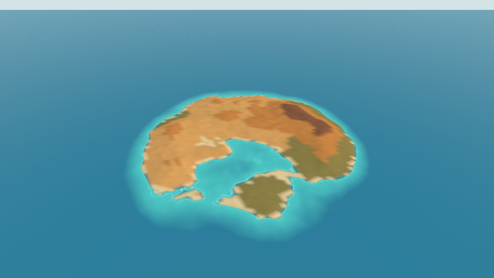
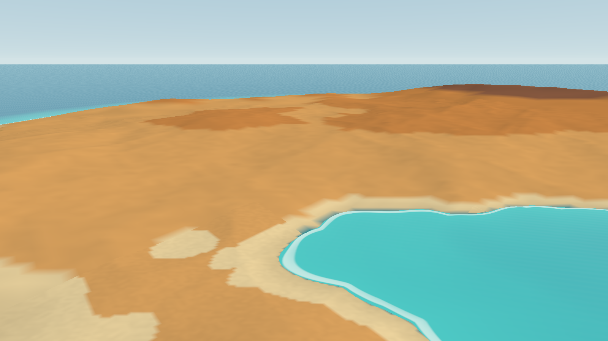
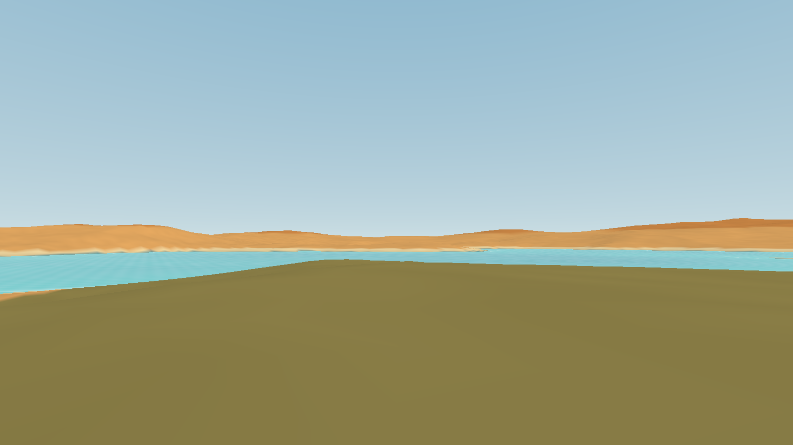
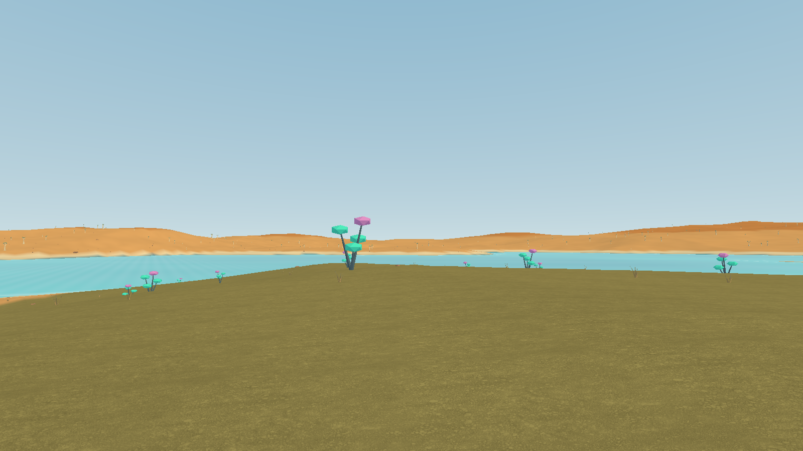

# Visual milestone catalogue

Captures are retained in order. Source references are labelled separately from real Unity Windows-player images. No concept art is used as implementation evidence. Camera changes and limitations are described per stage.

## 00 — Browser source reference · 2026-09-09

Actual local browser build of CityLife 0.53.1 at `b713070`, seed 4242, opened through its documented development mode. This captures the source sand/sea/neon palette and source interface. It is a newly initialized local source world, not authenticated production/player-save evidence. The Unity milestone is permitted to start with a fresh larger island; the old road and plot layout is intentionally deferred.

## 01 — Failed first player capture · 2026-09-09 19:56 UTC

[Retained black capture](../evidence/milestones/01-failed-black-player-2026-09-09.png)

The first Windows build compiled and passed deterministic checks, but its background route produced uniform black frames. Opening the actual native player exposed a URP initialization failure: the unused template SSAO feature remained in the renderer list while disabled, and its required resources were stripped. This is **failed visual evidence**, not a delivered milestone. The correction removes the unused feature from the renderer and hardens image evidence checks. Real visible-player verification follows.

## 02 — First visible Unity island · 2026-09-09

Actual Build 03 Windows player, seed 4242, viewed from Island vista after the Night button. The native window image was captured before desktop control was paused and preserved from the existing image in memory at 20:09 UTC; preserving it required no new desktop capture or input. The GUI event is timestamped 20:04:15 UTC in the runtime log. The island, water and interface are visible, confirming the black-player defect was corrected in this build. This is a window capture at desktop scale, not the full-resolution game framebuffer.

The finite ocean plane's far corner is visible at the top, and interface readability needs review at normal player size. These are remaining visual gaps. Native keyboard movement and screenshot shortcuts remain unverified. The user reported that the island looks good and resembles the earlier world; this is user feedback, separate from the captured evidence. No roads, plots or buildings are claimed by this image.

### 02b — User-requested framed snapshot · 2026-09-09 20:09 UTC

The coordinating task's Discord helper captured this actual open player under a separate, explicitly renewed capture-and-post instruction. It includes the CityLife Island title bar and control strip. The coordinator independently inspected the file before sending it to this catalogue. It shows the same Build 03 stage and shares the finite-ocean-edge, desktop-scale readability and native-input gaps above. The artifact's recorded write time is 20:09:52 UTC. Posting status is recorded separately from image creation.

The user subsequently reported manually posting this framed image in the CityLife Unity Discord channel. That posting is user-reported, not independently verified here. No duplicate post is made by this implementation task.

## 03 — Offscreen candidate route · 2026-09-09 20:19 UTC

The candidate built at 20:18:30 UTC renders the same versioned island through URP's single-camera render request into a 1600×900 GPU texture. The overview was saved at approximately 20:19:01 UTC. The former finite ocean corner is absent. This is actual application scene output, not concept art or desktop capture. It intentionally excludes the HUD and does not establish native window presentation. Distant water still shows fine aliasing and the overview uses coarse terrain LOD.

Flight phase, approximately 20:19:09 UTC, after 297.95m of scripted movement over the neighbourhood reserve. This shows coastline and relief at a closer scale. It does not imply plots, construction permissions or buildings.

Walking phase, approximately 20:19:17 UTC, after 48.66m of scripted travel at eye height. Recorded ground penetration was zero. These views do not establish the appearance of vegetation, native mouse look, WASD responsiveness or object collisions. All three images were inspected. [The exact route report](../evidence/verified/offscreen-route.json) retains timings, poses, render coverage, image checks and acceptance limits.

The walking image is retained as the **before** baseline for the next close-up detail iteration. Its flat olive surface is terrain colour; no visible grass blades, tufts, rocks or trees are claimed from that image.

## 04 — Arid ground detail, before and after · 2026-09-09 20:29–20:35 UTC

The same landing/walking route now shows visible straw-coloured tufts, dry-ground texture and the original-style cyan/magenta plants. Compare with **03 walking** above. The texture is Poly Haven's CC0 Dry Mud Field 001; grass, rocks, quiver forms and neon plants are procedural geometry in this repository. The Kenney models in the asset catalogue were not imported into this scene.

Earlier transient instance submissions counted plants without rendering them in the offscreen route. Persistent chunk-owned vegetation meshes corrected that defect. Counters remain estimates of enabled geometry, not proof of pixel visibility. The 20:29 images were inspected: [overview](../evidence/milestones/04a-arid-overview-2026-09-09.png), [flight](../evidence/milestones/04b-arid-flight-2026-09-09.png), and [route report](../evidence/verified/arid-detail-route.json). Far-water ripple filtering also reduces the earlier moiré.

The 20:35 close-up uses the new **4 / Detail** viewpoint at 1.85m above ground, a few metres from the actual generated tuft nearest Landing. Individual blades, small rocks and surface detail are visible. No scenery was inserted for the screenshot. This is offscreen URP scene output, excluding HUD and native input. The [final candidate report](../evidence/verified/final-candidate-route.json) retains all four images, including repeated overview/flight/walking checks. Earlier milestone files remain unchanged.

The bounded first detail pass is verified in these images. Density, wind, richer ground blending, native presentation and manual traversal remain later acceptance or visual-polish work. The [free-asset catalogue](ASSET-CATALOGUE.md) records what is available, imported and tested. Its optional [enlarged HTML view](ASSET-CATALOGUE.html) uses unchanged asset pixels with CSS framing; opening that local HTML was blocked by the browser URL policy, so browser layout remains unverified.
